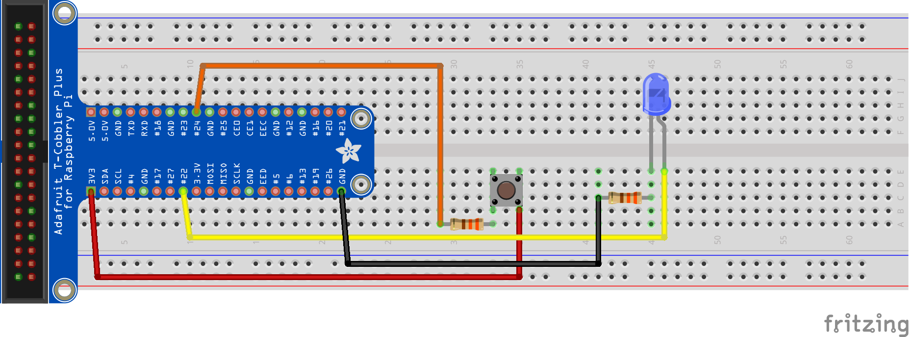

 Pi4J V2 :: Java I/O Library for Raspberry Pi :: Minimal example application
==========================================================================

GitHub Actions: 

This project contains a minimal example application which uses the Pi4J (V2) library and uses a digital output (LED) 
and digital input (push button). Full description is available on [the Pi4J website](https://pi4j.com/getting-started/minimal-example-application)

## PROJECT OVERVIEW

The goal of the example project is to show how to set up a Pi4J Maven / Gradle project for the Raspberry Pi.

## WIRING

The application needs a LED connected on BCM 22 and button on BCM 24. 

## BUILD DEPENDENCIES & INSTRUCTIONS

This project can be built with Maven and Gradle, which is fully described with step-by-step instructions on the [Pi4J website > Getting started with Pi4J > Minimal example application](https://pi4j.com/getting-started/minimal-example-application/).

## LICENSE

 Pi4J Version 2.0 and later is licensed under the Apache License,
 Version 2.0 (the "License"); you may not use this file except in
 compliance with the License.  You may obtain a copy of the License at:
      http://www.apache.org/licenses/LICENSE-2.0

 Unless required by applicable law or agreed to in writing, software
 distributed under the License is distributed on an "AS IS" BASIS,
 WITHOUT WARRANTIES OR CONDITIONS OF ANY KIND, either express or implied.
 See the License for the specific language governing permissions and
 limitations under the License.

